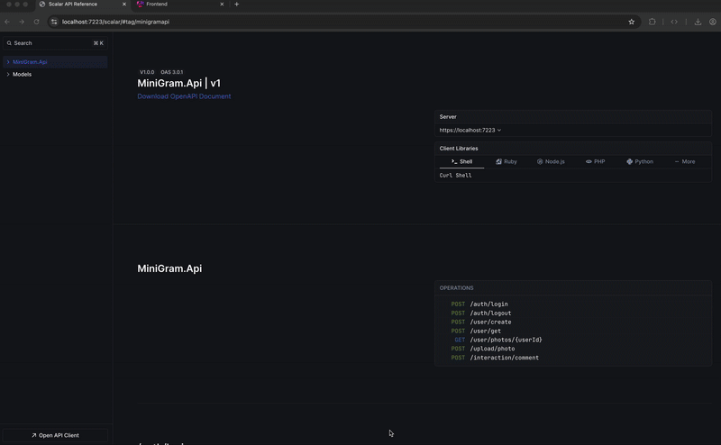
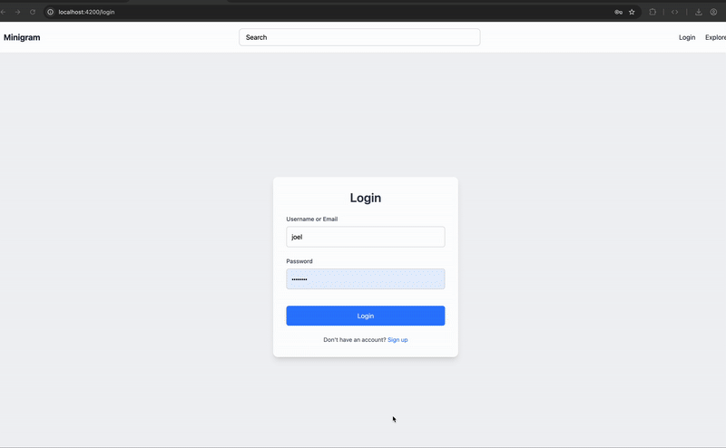

# ApiDemo

#### A work-in-progress example application

### What’s Working

- Login flow
- Registration flow
- File upload
- Validation
- Integration tests
- `[Authorize]` attributes (currently disabled in places for testing)
- Shared client package for communication between backend services and integration testing

---

### Not Yet Implemented

- Refresh token flow
- Full authentication enforcement (partially disabled to facilitate testing)
- Logout flow

---

## Setup

Make sure Docker and the .NET SDK are installed.

start an SQL-server instance, (i use):

```bash
docker run -e "ACCEPT_EULA=Y" \
  -e "MSSQL_SA_PASSWORD=MyPass@word" \
  -e "MSSQL_PID=Developer" \
  -e "MSSQL_USER=SA" \
  -p 1433:1433 \
  -d --name=sqldb \
  mcr.microsoft.com/azure-sql-edge
```

### Database Setup

Navigate to the API project folder and apply migrations:

```bash
cd MiniGram.Api
dotnet ef database update
```

### Running the API

Start the project and navigate to:

```
https://localhost:5259/scalar/
```

You can now test the API using Scalar or the frontend.

---

## Frontend

To start the Angular frontend:

```bash
ng serve
```

Then open:

```
http://localhost:4200
```

Register a new account and test file uploads.

---

## Demo

### General Usage



### Registration Flow


